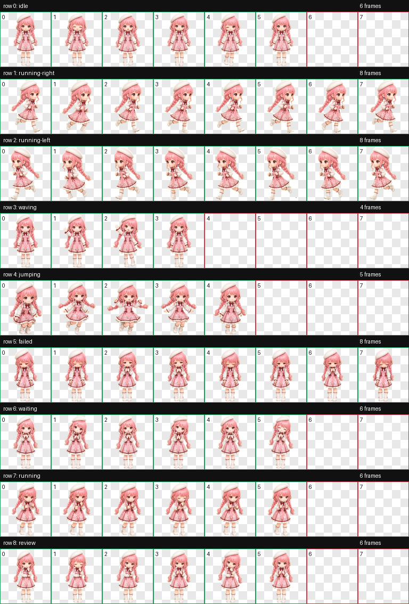

<div align="center">
  

  <h1>Nikki Bloom Poetry Codex Pet</h1>

  <p>
    A Q-style 3D Nikki custom pet for the Codex desktop app, inspired by Nikki from <em>Shining Nikki</em> wearing her classic <em>Bloom Poetry</em> outfit, packed into Codex's fixed 8x9 pet atlas format.
  </p>

  <p>
    <a href="README.md">简体中文</a>
    ·
    <a href="README_en.md"><strong>English</strong></a>
    ·
    <a href="README_ja.md">日本語</a>
    ·
    <a href="README_ko.md">한국어</a>
  </p>

  <p>
    <a href="#installation"></a>
    <a href="#preview"></a>
    
    
    <a href="LICENSE"></a>
  </p>
</div>

> This is a fan-made custom pet resource. It is not an official Papergames, Infold Games, or Nikki series project.

## Preview



### Action GIFs

| Idle | Run Right | Run Left |
| --- | --- | --- |
|  |  |  |

| Wave | Jump | Failed / Downcast |
| --- | --- | --- |
|  |  |  |

| Waiting | Working | Review / Done |
| --- | --- | --- |
|  |  |  |

## Features

- Q-style 3D character with Nikki's pink twin braids, white beret, gentle eyes, and soft heroine charm.
- Based on the *Bloom Poetry* outfit: pink plaid dress, burgundy bow, lace trim, white socks and shoes, and small floral details.
- Codex-ready atlas: `1536x1872`, 8 columns x 9 rows, `192x208` cells.
- Includes all 9 Codex states: `idle`, `running-right`, `running-left`, `waving`, `jumping`, `failed`, `waiting`, `running`, and `review`.
- `waiting` reads as an expectant stylist-check pose, `running` as focused task work, and `review` as checking completed output.
- Validated RGBA atlas with transparent background, transparent unused cells, and no transparent-pixel RGB residue.

## Installation

Recommended: download `nikki-bloom-poetry-codex-pet-v1.0.0.zip` from Releases. After extraction, you will get the two files needed for installation:

```text
pet.json
spritesheet.webp
```

Copy the two files from `dist` into your Codex custom pet directory:

```text
$HOME/.codex/pets/nikki-bloom-poetry/
├── pet.json
└── spritesheet.webp
```

On Windows, use:

```text
%CODEX_HOME%\pets\nikki-bloom-poetry\
├── pet.json
└── spritesheet.webp
```

The ready-to-use files are included here:

- [dist/pet.json](dist/pet.json)
- [dist/spritesheet.webp](dist/spritesheet.webp)

Restart Codex and select **Nikki Bloom Poetry** from the custom pet list.

## Package Layout

```text
.
├── assets/
│   ├── contact-sheet.png
│   ├── preview.png
│   └── previews/*.gif
├── dist/
│   ├── pet.json
│   ├── spritesheet.webp
│   ├── spritesheet.png
│   └── validation.json
├── docs/
│   └── sources-manifest.json
├── LICENSE
├── NOTICE.md
├── README.md
├── README_en.md
├── README_ja.md
└── README_ko.md
```

## Release Notes

Current release: `v1.0.0`.

- Uses the complete 9-row Codex pet atlas.
- Keeps `running-left` and `running-right` direction semantics consistent.
- Preserves one Nikki Bloom Poetry identity across all states without text, UI, logos, or official-art screenshots.
- The root repository omits generation intermediates; `dist/` is the install package and `assets/` is for previews.

Codex uses fixed frame counts per atlas row, so the final atlas fills each row according to the Codex state specification instead of forcing every state to use the same number of frames.

## Credits and License

- Outfit naming and cross-game naming notes are recorded in [docs/sources-manifest.json](docs/sources-manifest.json).
- This repository's original packaging, documentation, and metadata are released under the [MIT License](LICENSE).
- Nikki, *Shining Nikki*, and related official designs belong to their respective rights holders.
- This repository does not redistribute official splash art; it only includes the prepared Codex pet package and preview assets.
